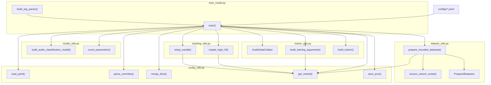

# File and Function Relationships

```mermaid
graph TD
  Y["configs/*.yaml"]

  subgraph TM["train_model.py"]
    TM1["build_arg_parser()"]
    TM2["main()"]
  end

  subgraph CU["config_utils.py"]
    CU1["load_yaml()"]
    CU2["parse_overrides()"]
    CU3["merge_dicts()"]
    CU4["get_nested()"]
    CU5["save_json()"]
  end

  subgraph TK["tracking_utils.py"]
    TK1["maybe_login_hf()"]
    TK2["setup_wandb()"]
  end

  subgraph DU["dataset_utils.py"]
    DU1["prepare_encoded_datasets()"]
    DU2["ensure_column_exists()"]
    DU3["PreparedDatasets"]
  end

  subgraph MU["model_utils.py"]
    MU1["build_audio_classification_model()"]
    MU2["count_parameters()"]
  end

  subgraph TR["trainer_utils.py"]
    TR1["AudioDataCollator"]
    TR2["build_training_arguments()"]
    TR3["build_trainer()"]
  end

  Y --> TM2
  TM1 --> TM2

  TM2 --> CU1
  TM2 --> CU2
  TM2 --> CU3
  TM2 --> CU4
  TM2 --> CU5

  TM2 --> TK1
  TM2 --> TK2

  TM2 --> DU1
  DU1 --> DU2
  DU1 --> DU3

  TM2 --> MU1
  TM2 --> MU2

  TM2 --> TR1
  TM2 --> TR2
  TM2 --> TR3

  DU1 --> CU4
  TR2 --> CU4
  TK1 --> CU4
  TK2 --> CU4
```
