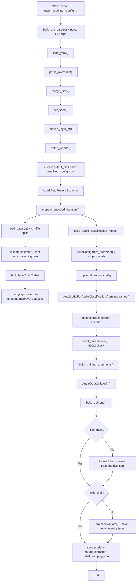

# Training Execution Flow

```mermaid
flowchart TD
  A["Start: python train_model.py --config ..."] --> B["build_arg_parser() + parse CLI args"]
  B --> C["load_yaml()"]
  C --> D["parse_overrides()"]
  D --> E["merge_dicts()"]
  E --> F["set_seed()"]

  F --> G["maybe_login_hf()"]
  G --> H["setup_wandb()"]

  H --> I["Create output_dir + save resolved_config.json"]
  I --> J["Load AutoFeatureExtractor"]
  J --> K["prepare_encoded_datasets()"]

  K --> K1["load_dataset() + shuffle splits"]
  K1 --> K2["validate columns + cast audio sampling rate"]
  K2 --> K3["build label2id/id2label"]
  K3 --> K4["map preprocess() to encoded train/eval datasets"]

  K --> L["build_audio_classification_model()"]
  L --> L1["AutoConfig.from_pretrained() + inject labels"]
  L1 --> L2["optional dropout config"]
  L2 --> L3["AutoModelForAudioClassification.from_pretrained()"]
  L3 --> L4["optional freeze feature encoder"]

  L4 --> M["count_parameters() + 600M check"]

  M --> N["build_training_arguments()"]
  N --> O["AudioDataCollator(...)"]
  O --> P["build_trainer(...)"]

  P --> Q{"--skip-train ?"}
  Q -- "No" --> R["trainer.train() + save train_metrics.json"]
  Q -- "Yes" --> S
  R --> S{"--skip-eval ?"}
  S -- "No" --> T["trainer.evaluate() + save eval_metrics.json"]
  S -- "Yes" --> U
  T --> U["save model + feature_extractor + label_mapping.json"]
  U --> V["End"]
```
